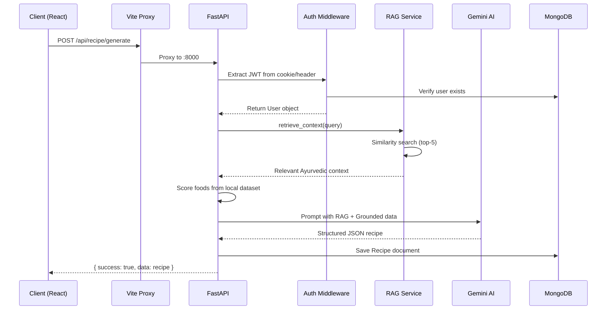
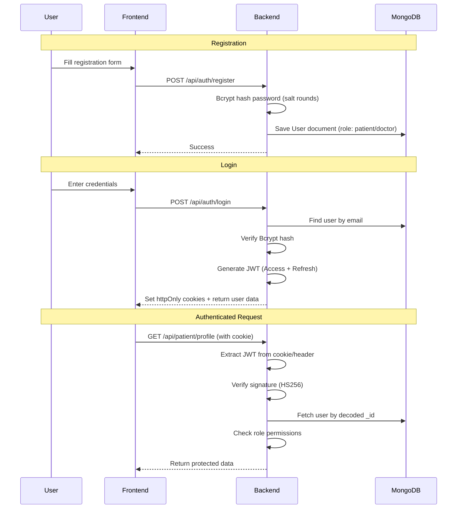
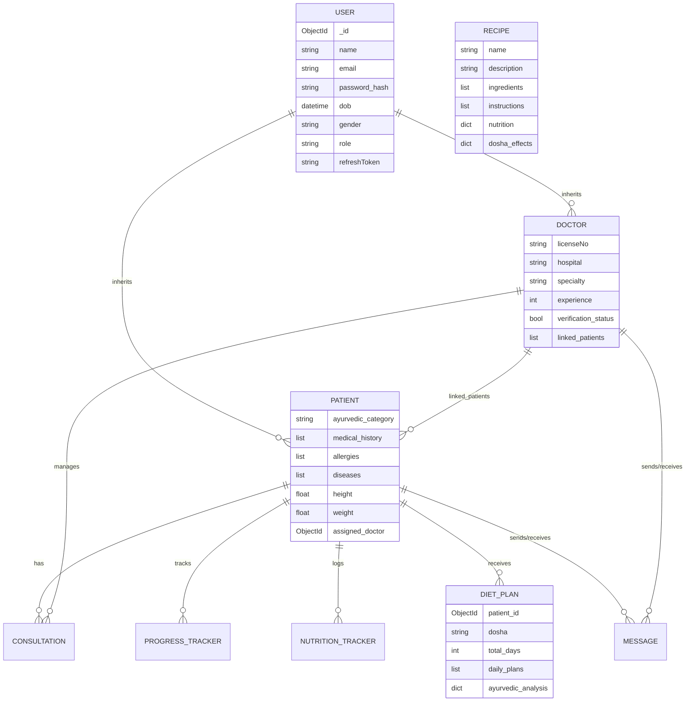

<div align="center">

# 🌿 SwasthaSetu

### *Bridging Ancient Ayurvedic Wisdom with Modern AI Healthcare*

[](https://fastapi.tiangolo.com/)
[](https://react.dev/)
[](https://www.mongodb.com/)
[](https://ai.google.dev/)
[](https://www.langchain.com/)
[](https://www.typescriptlang.org/)
[](https://tailwindcss.com/)
[](https://opensource.org/licenses/MIT)

**SwasthaSetu** is an AI-powered healthcare platform that combines **Retrieval-Augmented Generation (RAG)**, **Google Gemini 2.5 Flash**, and a curated **Ayurvedic knowledge base** to deliver personalized diet plans, hallucination-free recipe generation, intelligent food scanning, and secure doctor-patient collaboration — all behind a robust **Role-Based Access Control (RBAC)** system.

[🚀 Live Demo](https://swastha-setu-seven.vercel.app) · [📖 API Docs](#-api-reference) · [🏗️ Architecture](#%EF%B8%8F-system-architecture)

</div>

---

## 📋 Table of Contents

- [✨ Key Features](#-key-features)
- [🏗️ System Architecture](#%EF%B8%8F-system-architecture)
- [🤖 AI Pipeline Deep Dive](#-ai-pipeline-deep-dive)
- [🔐 Security Architecture](#-security-architecture)
- [🛠️ Tech Stack](#%EF%B8%8F-tech-stack)
- [📁 Project Structure](#-project-structure)
- [🚀 Getting Started](#-getting-started)
- [📡 API Reference](#-api-reference)
- [🗄️ Database Schema](#%EF%B8%8F-database-schema)
- [☁️ Deployment](#%EF%B8%8F-deployment)

---

## ✨ Key Features

| Feature | Description | Tech |
|---|---|---|
| 🤖 **Setu AI Assistant** | Agentic health chatbot with action tags for navigation, meal/water logging | Gemini 2.5 Flash + RAG |
| 🍲 **Recipe Generator** | Dosha-aware Ayurvedic recipe generation with grounded nutritional data | Hybrid RAG + Deterministic Scoring |
| 🥗 **Diet Plan Generator** | Multi-day structured diet plans based on patient biometrics | Gemini + Patient Context |
| 📷 **Food Scanner** | Barcode scanning via zxing-cpp + AI Vision for food label analysis | OpenFoodFacts API + Gemini Vision |
| 🔐 **Role-Based Access** | Strict Doctor/Patient RBAC with JWT authentication | Bcrypt + JWT + FastAPI DI |
| 📊 **Health Tracking** | Water intake, meal logging, nutrition tracking with visual analytics | Recharts + MongoDB |
| 💬 **Messaging System** | Real-time doctor-patient communication | WebSocket-ready architecture |
| 📄 **PDF Reports** | Client-side generation of health reports and certificates | jsPDF + jsPDF-AutoTable |
| 📁 **Medical Documents** | Secure medical document upload and storage | AWS S3 |

---

## 🏗️ System Architecture

### High-Level Overview

```
┌─────────────────────────────────────────────────────────────────────┐
│                        CLIENT (React + Vite)                        │
│  ┌──────────┐ ┌──────────┐ ┌──────────┐ ┌──────────┐ ┌──────────┐ │
│  │ Patient  │ │  Doctor  │ │   AI     │ │  Recipe  │ │  Health  │ │
│  │Dashboard │ │Dashboard │ │ Chatbot  │ │Generator │ │ Tracking │ │
│  └────┬─────┘ └────┬─────┘ └────┬─────┘ └────┬─────┘ └────┬─────┘ │
│       │             │            │             │            │       │
│       └─────────────┴────────────┴─────────────┴────────────┘       │
│                              │ Axios / API                          │
│                     Vite Dev Proxy (:5173)                           │
└─────────────────────────────┬───────────────────────────────────────┘
                              │ HTTP/REST
┌─────────────────────────────▼───────────────────────────────────────┐
│                    FastAPI Backend (:8000)                           │
│  ┌──────────────────────────────────────────────────────────────┐   │
│  │                    CORS Middleware                            │   │
│  │              (Regex-based origin matching)                    │   │
│  ├──────────────────────────────────────────────────────────────┤   │
│  │                  JWT Auth Middleware                          │   │
│  │        (Cookie + Bearer Token extraction)                    │   │
│  ├──────────┬──────────┬──────────┬──────────┬─────────────────┤   │
│  │ /api/auth│ /api/ai  │/api/recipe│/api/diet │ /api/doctor    │   │
│  │ /api/patient│/api/files│/api/progress│/api/consultation│    │   │
│  │ /api/messages                                               │   │
│  ├──────────────────────────────────────────────────────────────┤   │
│  │               Core Services Layer                            │   │
│  │  ┌─────────────┐  ┌──────────────┐  ┌──────────────────┐   │   │
│  │  │ RAG Service  │  │ Security     │  │ Food Scoring     │   │   │
│  │  │ (LangChain)  │  │ (JWT+Bcrypt) │  │ Algorithm        │   │   │
│  │  └──────┬──────┘  └──────────────┘  └──────────────────┘   │   │
│  │         │                                                    │   │
│  │  ┌──────▼──────┐                                            │   │
│  │  │InMemory     │                                            │   │
│  │  │VectorStore  │                                            │   │
│  │  └─────────────┘                                            │   │
│  └──────────────────────────────────────────────────────────────┘   │
└──────────┬──────────────────┬──────────────────┬───────────────────┘
           │                  │                  │
    ┌──────▼──────┐   ┌──────▼──────┐   ┌───────▼──────┐
    │  MongoDB    │   │Google Gemini│   │   AWS S3     │
    │  Atlas      │   │  2.5 Flash  │   │  (Documents) │
    └─────────────┘   └─────────────┘   └──────────────┘
```

### Request Lifecycle



---

## 🤖 AI Pipeline Deep Dive

### Recipe Generation: Hybrid RAG + Deterministic Grounding

The recipe generator is designed to **eliminate AI hallucinations** in a health-critical domain by combining three data sources:

```
  ┌──────────────────┐     ┌────────────────────┐     ┌──────────────────────┐
  │  1. RAG Context  │     │  2. Deterministic   │     │  3. LLM Generation   │
  │  (Semantic)      │     │  Food Scoring       │     │  (Creative)          │
  ├──────────────────┤     ├────────────────────┤     ├──────────────────────┤
  │                  │     │                    │     │                      │
  │ InMemoryVector   │     │ ayurvedic_foods    │     │ Google Gemini        │
  │ Store with       │     │ .json (796 lines)  │     │ 2.5 Flash            │
  │ Google Embeddings│     │                    │     │                      │
  │                  │     │ Custom scoring:    │     │ Strict instructions: │
  │ Queries:         │     │ +3 name match      │     │ "Do NOT invent       │
  │ "Recipe for      │     │ +2 dosha balance   │     │  Ayurvedic           │
  │  {meal} for      │     │ +1 neutral         │     │  properties"         │
  │  {dosha} dosha"  │     │ -2 dosha conflict  │     │                      │
  │                  │     │                    │     │ Returns strict JSON  │
  │ Returns top-5    │     │ Returns top-12     │     │ with validated       │
  │ relevant docs    │     │ scored foods       │     │ schema               │
  └────────┬─────────┘     └────────┬───────────┘     └──────────┬───────────┘
           │                        │                             │
           └────────────────────────┼─────────────────────────────┘
                                    │
                          ┌─────────▼──────────┐
                          │  Combined Prompt    │
                          │  ─────────────────  │
                          │  RAG Context +      │
                          │  Grounded Food      │
                          │  Reference Table +  │
                          │  Patient Dosha +    │
                          │  JSON Schema        │
                          └─────────┬──────────┘
                                    │
                          ┌─────────▼──────────┐
                          │  Gemini 2.5 Flash   │
                          │  ─────────────────  │
                          │  Generates creative │
                          │  recipe using ONLY  │
                          │  grounded data      │
                          └─────────┬──────────┘
                                    │
                          ┌─────────▼──────────┐
                          │  Regex JSON Parse   │
                          │  + Beanie ODM Save  │
                          └────────────────────┘
```

> **Key Design Decision:** Creativity (cooking instructions, proportions) is decoupled from Medical Facts (Rasa, Virya, Guna, Dosha effects). The LLM generates the recipe, but Ayurvedic properties are enforced from a verified dataset — guaranteeing zero medical hallucinations.

### Setu AI Assistant: Agentic Action Tags

The AI chatbot uses an **agentic pattern** where the LLM response includes embedded action tags that the frontend parses and executes:

| Action Tag | Trigger | Frontend Behavior |
|---|---|---|
| `[ACTION:MARK_WATER:250]` | User mentions drinking water | Logs 250ml water intake |
| `[ACTION:MARK_MEAL]` | User mentions eating | Opens meal logging dialog |
| `[ACTION:NAVIGATE:/recipes]` | User asks about recipes | Navigates to recipes page |
| `[ACTION:OPEN_PATIENT_VIEW:id]` | Doctor asks about a patient | Opens patient detail view |

### Food Scanner: Multi-Strategy Pipeline

```
Image/Barcode Input
        │
        ├── 1. Extract barcode from image (zxing-cpp)
        │         │
        │         ├── Found barcode ──► OpenFoodFacts API lookup
        │         │                          │
        │         │                    ┌─────▼─────┐
        │         │                    │ Product    │──► Return nutrition data
        │         │                    │ Found?     │
        │         │                    └─────┬─────┘
        │         │                          │ Not found
        │         └──────────────────────────┤
        │                                    │
        ├── 2. QR Code with JSON payload ──► Parse & return directly
        │                                    │
        └── 3. Gemini Vision fallback ──► AI analyzes food image
                                              │
                                         Return nutrition +
                                         Ayurvedic tags
```

---

## 🔐 Security Architecture

### Authentication Flow



### Role-Based Access Control (RBAC)

```
┌─────────────────────────────────────────────────────┐
│                   JWT Token Payload                  │
│  { "_id": "user_id", "email": "...", "role": "..." }│
└───────────────────────┬─────────────────────────────┘
                        │
                ┌───────▼──────┐
                │ get_current  │    FastAPI Dependency
                │ _user()      │◄── Injection
                └───────┬──────┘
                        │
              ┌─────────▼─────────┐
              │   Role Check      │
              ├───────────────────┤
              │                   │
    ┌─────────▼──────┐  ┌────────▼────────┐
    │   Patient      │  │    Doctor        │
    │   Routes       │  │    Routes        │
    ├────────────────┤  ├─────────────────┤
    │ GET  /profile  │  │ GET  /patients  │
    │ POST /tracking │  │ POST /diet/gen  │
    │ GET  /recipes  │  │ POST /recipe/gen│
    │ POST /scan     │  │ GET  /consult   │
    └────────────────┘  └─────────────────┘
```

**Key Implementation Details:**
- Passwords hashed with **Bcrypt** via Passlib (`CryptContext`)
- JWTs signed with **HS256** algorithm
- Token extraction from both **httpOnly cookies** and **Authorization headers**
- Polymorphic user model: `User` → `Patient` / `Doctor` (Beanie document inheritance)

---

## 🛠️ Tech Stack

### Frontend

| Category | Technologies |
|---|---|
| **Core** | React 18, TypeScript, Vite |
| **UI Framework** | Tailwind CSS 3, Radix UI, Shadcn/ui |
| **Animations** | Framer Motion |
| **3D Graphics** | Three.js (via @react-three/fiber) |
| **Charts** | Recharts (D3-based) |
| **State Management** | TanStack Query v5 |
| **Forms** | React Hook Form + Zod validation |
| **HTTP Client** | Axios |
| **PDF Generation** | jsPDF + jsPDF-AutoTable |
| **Icons** | Lucide React |
| **Theming** | next-themes (dark/light mode) |

### Backend

| Category | Technologies |
|---|---|
| **Framework** | FastAPI (ASGI) + Uvicorn |
| **AI / LLM** | Google Gemini 2.5 Flash |
| **RAG Pipeline** | LangChain + InMemoryVectorStore + Google Embeddings |
| **Database** | MongoDB Atlas + Motor (async) + Beanie ODM |
| **Auth** | JWT (PyJWT) + Bcrypt (Passlib) |
| **Validation** | Pydantic v2 |
| **File Storage** | AWS S3 (Boto3) |
| **Barcode Scanning** | zxing-cpp + Pillow |
| **External APIs** | OpenFoodFacts |

### Infrastructure

| Category | Technologies |
|---|---|
| **Frontend Hosting** | Vercel |
| **Backend Hosting** | Render |
| **Database** | MongoDB Atlas (Cloud) |
| **File Storage** | AWS S3 |

---

## 📁 Project Structure

```
SwasthaSetu/
├── frontend/                          # React SPA
│   ├── client/
│   │   ├── components/
│   │   │   ├── app/                   # Application-specific components
│   │   │   ├── doctor/                # Doctor-only UI components
│   │   │   └── ui/                    # Shadcn/Radix UI primitives
│   │   ├── context/                   # React Context (App State, Auth)
│   │   ├── hooks/                     # Custom React hooks
│   │   ├── lib/                       # Utility functions
│   │   ├── pages/
│   │   │   ├── auth/                  # Login, Register
│   │   │   ├── user/                  # Patient Dashboard, Recipes, Tracking, Scan
│   │   │   ├── doctor/                # Doctor Dashboard, Patients, Diet Generator
│   │   │   └── messages/              # Doctor-Patient messaging
│   │   ├── types/                     # TypeScript type definitions
│   │   ├── App.tsx                    # Root component with routing
│   │   └── global.css                 # Global styles
│   ├── vite.config.ts                 # Vite config with API proxy
│   └── package.json
│
├── backend/                           # FastAPI Backend
│   ├── app/
│   │   ├── api/endpoints/
│   │   │   ├── auth.py                # Login, Register, Token refresh
│   │   │   ├── ai.py                  # Setu AI chatbot + Food scanner
│   │   │   ├── recipe.py              # Ayurvedic recipe generation
│   │   │   ├── diet.py                # Multi-day diet plan generation
│   │   │   ├── doctor.py              # Doctor-specific operations
│   │   │   ├── patient.py             # Patient profile management
│   │   │   ├── consultation.py        # Doctor-patient consultations
│   │   │   ├── progress.py            # Health & nutrition tracking
│   │   │   ├── files.py               # Medical document uploads (S3)
│   │   │   └── messages.py            # Messaging system
│   │   ├── core/
│   │   │   ├── config.py              # Pydantic Settings (env vars)
│   │   │   ├── database.py            # MongoDB + Beanie initialization
│   │   │   └── security.py            # JWT + Bcrypt + RBAC guards
│   │   ├── models/
│   │   │   ├── user.py                # User, Patient, Doctor (polymorphic)
│   │   │   ├── recipe.py              # Recipe document model
│   │   │   ├── dietplan.py            # Diet plan document model
│   │   │   ├── consultation.py        # Consultation document model
│   │   │   ├── progress.py            # Progress & Nutrition tracker
│   │   │   └── message.py             # Message document model
│   │   ├── services/
│   │   │   └── rag_service.py         # RAG pipeline (Vector Store + Embeddings)
│   │   ├── data/
│   │   │   └── ayurvedic_foods.json   # Curated Ayurvedic food database (796 lines)
│   │   └── main.py                    # FastAPI app entry point
│   └── requirements.txt
│
├── render.yaml                        # Render deployment config
├── tech_stack_details.md
└── README.md
```

---

## 🚀 Getting Started

### Prerequisites

- **Node.js** ≥ 18 & **pnpm** (frontend)
- **Python** ≥ 3.11 (backend)
- **MongoDB Atlas** account (or local MongoDB)
- **Google Gemini API Key** ([Get one here](https://aistudio.google.com/apikey))

### 1. Clone the Repository

```bash
git clone https://github.com/your-username/SwasthaSetu.git
cd SwasthaSetu
```

### 2. Backend Setup

```bash
cd backend

# Create and activate virtual environment
python -m venv venv
.\venv\Scripts\activate        # Windows
# source venv/bin/activate     # macOS/Linux

# Install dependencies
pip install -r requirements.txt

# Create environment file
cp .env.example .env
# Edit .env with your credentials (see below)
```

**Required `.env` variables:**

```env
MONGODB_URI=mongodb+srv://<user>:<pass>@<cluster>.mongodb.net/
DB_NAME=SWASTHASETU
GOOGLE_API_KEY=your_gemini_api_key
ACCESS_TOKEN_SECRET=your_random_secret_key
REFRESH_TOKEN_SECRET=your_random_refresh_key
AWS_ACCESS_KEY_ID=your_aws_key
AWS_SECRET_ACCESS_KEY=your_aws_secret
AWS_STORAGE_BUCKET_NAME=your_bucket_name
AWS_REGION=ap-south-1
```

**Start the backend:**

```bash
uvicorn app.main:app --host 0.0.0.0 --port 8000 --reload
```

### 3. Frontend Setup

```bash
cd frontend

# Install dependencies
pnpm install

# Start dev server
pnpm run dev
```

### 4. Access the Application

| Service | URL |
|---|---|
| Frontend | http://localhost:5173 |
| Backend | http://localhost:8000 |
| API Docs (Swagger) | http://localhost:8000/docs |
| API Docs (ReDoc) | http://localhost:8000/redoc |

---

## 📡 API Reference

### Authentication

| Method | Endpoint | Description | Auth |
|---|---|---|---|
| `POST` | `/api/auth/register` | Register a new patient or doctor | ❌ |
| `POST` | `/api/auth/login` | Login and receive JWT tokens | ❌ |
| `GET` | `/api/auth/me` | Get current authenticated user | ✅ |
| `POST` | `/api/auth/refresh` | Refresh access token | 🍪 |
| `POST` | `/api/auth/logout` | Logout and clear tokens | ✅ |

### AI & Intelligence

| Method | Endpoint | Description | Auth |
|---|---|---|---|
| `POST` | `/api/ai/ask` | Ask the Setu AI health assistant | Optional |
| `POST` | `/api/ai/scan` | Scan food barcode/image | ✅ |
| `POST` | `/api/recipe/generate` | Generate Ayurvedic recipe | ✅ |
| `GET` | `/api/recipe/all` | Get all saved recipes | ✅ |
| `POST` | `/api/diet/generate` | Generate multi-day diet plan | ✅ |

### Doctor & Patient

| Method | Endpoint | Description | Auth |
|---|---|---|---|
| `GET` | `/api/doctor/all` | List all doctors | ❌ |
| `GET` | `/api/doctor/patients` | Get doctor's patients | ✅ 🩺 |
| `POST` | `/api/doctor/add-patient` | Link patient to doctor | ✅ 🩺 |
| `GET` | `/api/patient/profile` | Get patient profile | ✅ |
| `PUT` | `/api/patient/profile` | Update patient profile | ✅ |

### Health Tracking

| Method | Endpoint | Description | Auth |
|---|---|---|---|
| `POST` | `/api/progress/log` | Log health progress | ✅ |
| `GET` | `/api/progress/history` | Get tracking history | ✅ |
| `POST` | `/api/files/upload` | Upload medical documents | ✅ |

> ✅ = Requires JWT &nbsp; 🩺 = Doctor role only &nbsp; 🍪 = Requires refresh token cookie

---

## 🗄️ Database Schema

### Document Models (MongoDB Collections)



---

## ☁️ Deployment

### Production Architecture

```
                    ┌──────────────┐
                    │   Vercel     │
                    │  (Frontend)  │
   User ──────────►│  React SPA   │
                    │  CDN + Edge  │
                    └──────┬───────┘
                           │ API calls
                    ┌──────▼───────┐
                    │   Render     │
                    │  (Backend)   │
                    │  FastAPI +   │
                    │  Uvicorn     │
                    └──┬───┬───┬──┘
                       │   │   │
            ┌──────────┘   │   └──────────┐
            │              │              │
     ┌──────▼─────┐ ┌─────▼──────┐ ┌─────▼─────┐
     │  MongoDB   │ │  Google    │ │  AWS S3   │
     │  Atlas     │ │  Gemini   │ │  (Docs)   │
     └────────────┘ └────────────┘ └───────────┘
```

The project includes a `render.yaml` for one-click backend deployment on Render, and the frontend is deployed to Vercel with automatic CI/CD via Git push.

---

## 🤝 Contributing

Contributions are welcome! Please feel free to submit a Pull Request.

1. Fork the project
2. Create your feature branch (`git checkout -b feature/AmazingFeature`)
3. Commit your changes (`git commit -m 'Add some AmazingFeature'`)
4. Push to the branch (`git push origin feature/AmazingFeature`)
5. Open a Pull Request

---

## 📄 License

This project is licensed under the MIT License — see the [LICENSE](LICENSE) file for details.

---

<div align="center">

**Built with ❤️ for better healthcare**

*SwasthaSetu — स्वास्थ्य सेतु — A Bridge to Wellness*

</div>
